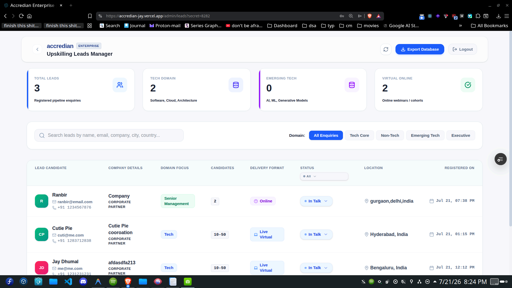
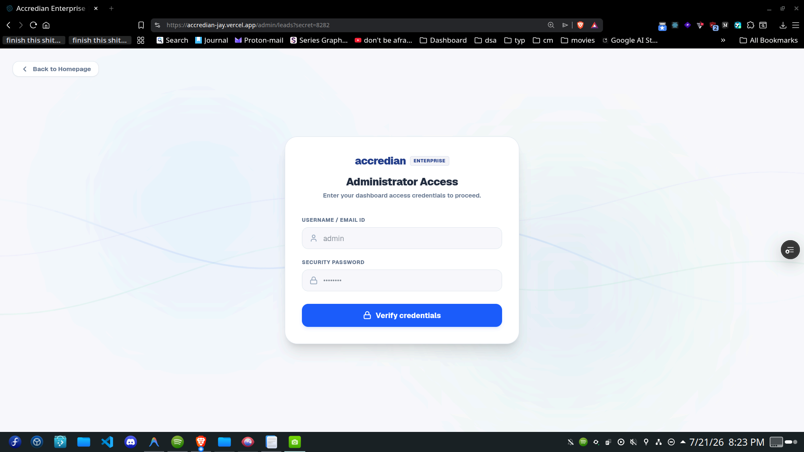
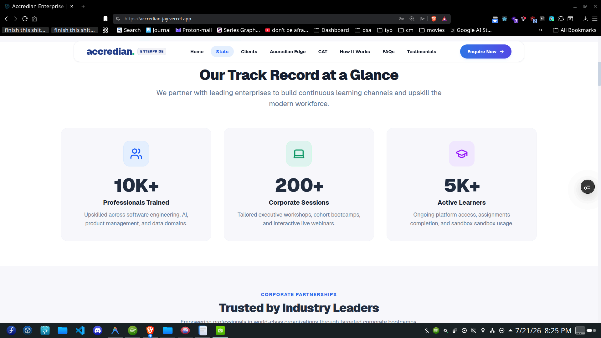

# Accredian Enterprise Clone

Recreation of the Accredian Enterprise landing page (`https://enterprise.accredian.com/`) built using Next.js (App Router), TypeScript, and Tailwind CSS.

---


<br/>

<br/>


## Setup Instructions

Follow these steps to run the project locally:

### 1. Prerequisites
Ensure you have [Node.js](https://nodejs.org/) (v18.x or later) and npm installed.

### 2. Installation
Clone the repository and install dependencies:
```bash
# Navigate to the project root directory
npm install
```

### 3. Run Development Server
Start the Next.js development server locally:
```bash
npm run dev
```
Open [http://localhost:3000](http://localhost:3000) in your browser to inspect the application.

### 4. Admin Leads Dashboard
To view, search, and export captured lead data, visit the Admin Panel route:
- URL: [http://localhost:3000/admin/leads](http://localhost:3000/admin/leads)
- query must be added to access it /leads?secret=8282
- username-admin
- pass-adminpass
  

### 5. Production Build
Compile the application for deployment or verification:
```bash
npm run build
```

---
